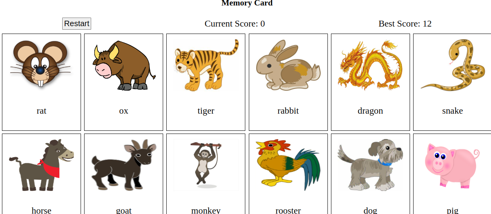

# 20.odin_memory_card

[Task Description](https://www.theodinproject.com/lessons/node-path-javascript-memory-card)

[Live Preview](https://maxim55069633.github.io/20.odin_memory_card/)

This project deepens my understanding on react hook, how to implement different lifecycle methods in functional components. 

I learn:
1. `event.currentTarget`: Refers to the DOM element that registered the event.
2. Sharing state between components by lifting shared state up to their common closet ancestor.

sample:

I use the following images from bing under the license: free to share and use commercially
1. [rat](https://cn.bing.com/images/search?view=detailV2&ccid=7p%2fP2SpZ&id=753C53E5CDBB47E7F83B7C779B41AA63B1EBDD09&thid=OIP.7p_P2SpZ3KQgd-0v9H4niAAAAA&mediaurl=https%3a%2f%2fcdn.dailyclipart.net%2fwp-content%2fuploads%2fmedium%2fMouse.jpg&cdnurl=https%3a%2f%2fts1.cn.mm.bing.net%2fth%2fid%2fR-C.ee9fcfd92a59dca42077ed2ff47e2788%3frik%3dCd3rsWOqQZt3fA%26pid%3dImgRaw%26r%3d0%26sres%3d1%26sresct%3d1%26srh%3d799%26srw%3d906&exph=300&expw=340&q=mouse&simid=607998809249706555&FORM=IRPRST&ck=23BBB0077E980AEDC74C57B7D4BED197&selectedIndex=2&qft=+filterui%3alicense-L2_L3_L4&ajaxhist=0&ajaxserp=0)
2. [ox](https://www.bing.com/images/search?view=detailV2&ccid=wCViXxRS&id=7EE5DCD78B9BF5071B9D6A690DF0EEE660624C30&thid=OIP.wCViXxRSqftw8OQfPE3kQwHaFV&mediaurl=https%3a%2f%2fupload.wikimedia.org%2fwikipedia%2fcommons%2fthumb%2fd%2fd3%2fBull_cartoon_04.svg%2f1280px-Bull_cartoon_04.svg.png&exph=922&expw=1280&q=Ox+Cartoon&simid=607991035388439275&FORM=IRPRST&ck=0E4A1C17A687693809F164AE10AD1B7D&selectedIndex=0&qft=%2bfilterui%3alicense-L2_L3_L4&ajaxhist=0&ajaxserp=0)
3. [tiger](https://cn.bing.com/images/search?view=detailV2&ccid=xEkcpsz8&id=1745968DC4D2B4899CB82A04739215B37131BAF9&thid=OIP.xEkcpsz8iDM0u-XeZ4dVhwAAAA&mediaurl=https%3a%2f%2fcdn.dailyclipart.net%2fwp-content%2fuploads%2fmedium%2fclipart0032.jpg&cdnurl=https%3a%2f%2fts1.cn.mm.bing.net%2fth%2fid%2fR-C.c4491ca6ccfc883334bbe5de67875587%3frik%3d%252bboxcbMVknMEKg%26pid%3dImgRaw%26r%3d0&exph=220&expw=340&q=tiger&simid=608017178842312866&FORM=IRPRST&ck=76C6AD490A337801CF78E503333BE56F&selectedIndex=100&qft=+filterui%3alicense-L2_L3_L4&ajaxhist=0&ajaxserp=0)
4. [rabbit](https://cn.bing.com/images/search?view=detailV2&ccid=xRyCbYkZ&id=2B7B6B87883763EDDE0CB4574AC818342137EEA0&thid=OIP.xRyCbYkZKhYH_8wmyBTk1wAAAA&mediaurl=https%3a%2f%2fcdn.dailyclipart.net%2fwp-content%2fuploads%2fmedium%2fclipart0033.jpg&cdnurl=https%3a%2f%2fts1.cn.mm.bing.net%2fth%2fid%2fR-C.c51c826d89192a1607ffcc26c814e4d7%3frik%3doO43ITQYyEpXtA%26pid%3dImgRaw%26r%3d0%26sres%3d1%26sresct%3d1%26srh%3d799%26srw%3d931&exph=292&expw=340&q=rabbit&simid=608011273267660357&FORM=IRPRST&ck=8070716BBC5204BA8EA077A5ADB93436&selectedIndex=41&qft=+filterui%3alicense-L2_L3_L4&ajaxhist=0&ajaxserp=0)
5. [dragon](https://cn.bing.com/images/search?view=detailV2&ccid=scyl270O&id=6969827E29566007EF470230E447DBC83D91A781&thid=OIP.scyl270OL9WUBtQyz2L_5wHaED&mediaurl=https%3a%2f%2fhtml.scirp.org%2ffile%2f4-6304143x3.png&cdnurl=https%3a%2f%2fts1.cn.mm.bing.net%2fth%2fid%2fR-C.b1cca5dbbd0e2fd59406d432cf62ffe7%3frik%3dgaeRPcjbR%252bQwAg%26pid%3dImgRaw%26r%3d0&exph=281&expw=514&q=chinese+dragon&simid=608043936459595097&FORM=IRPRST&ck=D14BD7798A48C166B647FF6D102841FC&selectedIndex=10&qft=+filterui%3alicense-L2_L3_L4&ajaxhist=0&ajaxserp=0)
6. [snake](https://cn.bing.com/images/search?view=detailV2&ccid=l98oMlqi&id=BC8ADC88F047024193F2E1B33E9807E256D11DED&thid=OIP.l98oMlqiH5XkuP3ulJLkfAAAAA&mediaurl=https%3a%2f%2fcdn.dailyclipart.net%2fwp-content%2fuploads%2fmedium%2fclipart0038.jpg&cdnurl=https%3a%2f%2fts1.cn.mm.bing.net%2fth%2fid%2fR-C.97df28325aa21f95e4b8fdee9492e47c%3frik%3d7R3RVuIHmD6z4Q%26pid%3dImgRaw%26r%3d0%26sres%3d1%26sresct%3d1%26srh%3d799%26srw%3d974&exph=279&expw=340&q=snake&simid=608053896505733379&FORM=IRPRST&ck=C0DCFB3E445530F7A5F8352518272AE2&selectedIndex=80&qft=+filterui%3alicense-L2_L3_L4&ajaxhist=0&ajaxserp=0)
7. [horse](https://cn.bing.com/images/search?view=detailV2&ccid=JMxBgGJz&id=41D554BE8379AA4C32006AD6EC0F31A644231827&thid=OIP.JMxBgGJzAHE-D45CCmKeswAAAA&mediaurl=https%3a%2f%2fcdn.dailyclipart.net%2fwp-content%2fuploads%2fmedium%2fHorse.jpg&cdnurl=https%3a%2f%2fts1.cn.mm.bing.net%2fth%2fid%2fR-C.24cc4180627300713e0f8e420a629eb3%3frik%3dJxgjRKYxD%252bzWag%26pid%3dImgRaw%26r%3d0%26sres%3d1%26sresct%3d1%26srh%3d799%26srw%3d779&exph=349&expw=340&q=horse&simid=607998044768395372&FORM=IRPRST&ck=04B074597C95F2BDCF507241CD7C63B9&selectedIndex=94&qft=+filterui%3alicense-L2_L3_L4&ajaxhist=0&ajaxserp=0)
8. [goat](https://cn.bing.com/images/search?view=detailV2&ccid=CSC2diex&id=CF679498902061413447D06B9DA5E9BFE9EC7EBD&thid=OIP.CSC2diexLOHRGKjVV1YVMQAAAA&mediaurl=https%3a%2f%2fcdn.dailyclipart.net%2fwp-content%2fuploads%2fsmall%2fclipart0011.jpg&cdnurl=https%3a%2f%2fts1.cn.mm.bing.net%2fth%2fid%2fR-C.0920b67627b12ce1d118a8d557561531%3frik%3dvX7s6b%252fppZ1r0A%26pid%3dImgRaw%26r%3d0&exph=325&expw=250&q=goat&simid=608033005796750546&FORM=IRPRST&ck=C2AC4EFEB47163DD561C080457CE62A6&selectedIndex=61&qft=+filterui%3alicense-L2_L3_L4&ajaxhist=0&ajaxserp=0)
9. [monkey](https://cn.bing.com/images/search?view=detailV2&ccid=%2bRKPBV5M&id=D019C0FD4A17E9B8889C625DD85DBB878354317F&thid=OIP.-RKPBV5Mi5sSPOZwoDR53QAAAA&mediaurl=https%3a%2f%2fcdn.dailyclipart.net%2fwp-content%2fuploads%2fmedium%2f16.jpg&cdnurl=https%3a%2f%2fts1.cn.mm.bing.net%2fth%2fid%2fR-C.f9128f055e4c8b9b123ce670a03479dd%3frik%3dfzFUg4e7XdhdYg%26pid%3dImgRaw%26r%3d0&exph=272&expw=340&q=monkey&simid=608056185734508607&FORM=IRPRST&ck=19FEDF97247DD74DEFDFE012AB89B23A&selectedIndex=56&qft=+filterui%3alicense-L2_L3_L4&ajaxhist=0&ajaxserp=0)
10. [rooster](https://cn.bing.com/images/search?view=detailV2&ccid=pOu2N5K8&id=300381BC870B7237D28D74D19B8369159449888A&thid=OIP.pOu2N5K8Ab9Z28T5_TCUxwHaKy&mediaurl=https%3a%2f%2fts1.cn.mm.bing.net%2fth%2fid%2fR-C.a4ebb63792bc01bf59dbc4f9fd3094c7%3frik%3diohJlBVpg5vRdA%26riu%3dhttp%253a%252f%252fcdn.dailyclipart.net%252fwp-content%252fuploads%252fmedium%252fclipart0010.jpg%26ehk%3ddqhRybuAC8TS4zGfRsznm6GRQdtwzTopbu8h%252ffcIEPQ%253d%26risl%3d%26pid%3dImgRaw%26r%3d0%26sres%3d1%26sresct%3d1%26srh%3d799%26srw%3d549&exph=495&expw=340&q=rooster&simid=608009327641454541&FORM=IRPRST&ck=3954095EB21E5043CB9E88D4F7F282D6&selectedIndex=5&qft=+filterui%3alicense-L2_L3_L4&ajaxhist=0&ajaxserp=0)
11. [dog](https://cn.bing.com/images/search?view=detailV2&ccid=m5neGvQr&id=F5B1E8D211FB5C83184415296F34E03DBCCEAAC1&thid=OIP.m5neGvQr9OdcWSTHP_Bt5QAAAA&mediaurl=https%3a%2f%2fcdn.dailyclipart.net%2fwp-content%2fuploads%2fmedium%2fclipart0071.jpg&cdnurl=https%3a%2f%2fts1.cn.mm.bing.net%2fth%2fid%2fR-C.9b99de1af42bf4e75c5924c73ff06de5%3frik%3dwarOvD3gNG8pFQ%26pid%3dImgRaw%26r%3d0&exph=264&expw=340&q=dog&simid=608009422129928429&FORM=IRPRST&ck=9855210666A32E4B8099428188481530&selectedIndex=116&qft=+filterui%3alicense-L2_L3_L4&ajaxhist=0&ajaxserp=0)
12. [pig](https://cn.bing.com/images/search?view=detailV2&ccid=CwAHz3KC&id=97B93E17DDAB72186ECB822DA25A310BE2A2BBEE&thid=OIP.CwAHz3KCpZT8Y7MvyMzsLwHaFc&mediaurl=https%3a%2f%2fts1.cn.mm.bing.net%2fth%2fid%2fR-C.0b0007cf7282a594fc63b32fc8ccec2f%3frik%3d7rui4gsxWqItgg%26riu%3dhttp%253a%252f%252flh4.ggpht.com%252f_pqaElV4_Vr70IEBDNzeLKgHxfdKKR-IWyDYYP7h4R1k6AipfpGjnrWMuN4Hx__3gupLOMwCnxre9qOOFbKtFLUpSrA%253ds0%26ehk%3dqTXN7%252byxSbKYBayBuRELyAaZWi2WdoQT77KWFBAPFDA%253d%26risl%3d%26pid%3dImgRaw%26r%3d0&exph=1175&expw=1600&q=pig&simid=608001983250717177&FORM=IRPRST&ck=56E988B4306C995EDE07A7D8582FFF51&selectedIndex=17&qft=+filterui%3alicense-L2_L3_L4&ajaxhist=0&ajaxserp=0)
